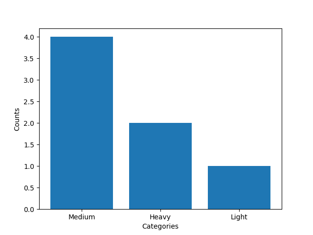

# Whale Species Size Analysis
This project uses basic data from seven whale species to analyzes how they are distributed by size contegory based on thier weights.
The goal of this project is to practice cleaning data, creating features, doing basic analysis, and visualization using python.

The dataset includes:
- The species name
- Their average length (meters)
- Their average weight (meters)
- Their primary location
The data was manually created for the purpose of this project

# Analysis
A size category section was added to the dataset based on the whale weight:
- Small : < 20,000 kg
- Medium : 20,000 - 80,000 kg
- Heavy : 80,000 kg
The most common size category in the dataset is "Medium", which indicates that most whale species in this dataset weigh between 20,000 and 80,000 kg

# Visualization 
A bar chart was created to show the number of whale species in each size category. The tallest bar corresponds to the "Medium" category, supporting the analysis results.

# Skills Used 
- Python
- pandas
- matplotlib
- Data cleaning and interpretation
- Data Visualization
